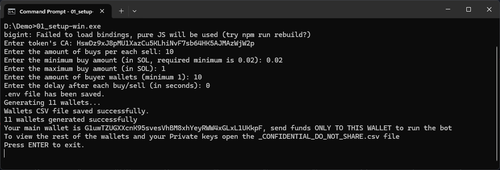
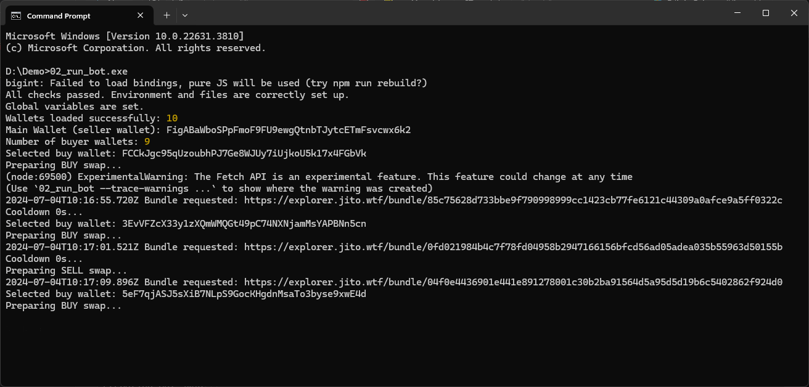

# Solana Bots by Poody

## 🐦 Arbitrage Bot for Solana 🚀

## 🐦 Volume Bot for Solana 🚀

### Maximize Your Token's Visibility with Our Premier Volume Boosting BOT

Unlock the potential of your Solana token by amplifying its trading volume with our cutting-edge volume bot. This full-service solution is designed to enhance your token's market presence, making it more visible and increasing its likelihood of trending on top analytical websites such as Dextools, Dexscreener, Birdeye, and more.

### Key Features and Benefits:

- **Boost Your Token’s Profile:** Our bot allows you to significantly increase the trading volume of any Solana token listed on Jupiter (verified or not - doesn't matter!), elevating its visibility and status within the market.
- **Trend on Major Platforms:** Higher trading volumes can lead to your token being featured as a trending asset on various crypto analytics platforms, which attracts more attention from investors and traders.
- **Fully Managed Service:** Enjoy a hassle-free experience with our bot. No need to worry about technical expertise, just run the .exe files!
- **Low Fees:** You don't need to pay enormous amounts to buy the code from us - it is actually FREE! The bot only transfers out 0.08% of each landed transaction.

### Advanced Technology for Authentic Engagement:

- **Dynamic Trading with Multiple Wallets:** Our system utilizes multiple wallets that engage in buying activities to mimic organic market behavior, enhancing the authenticity of the trade volumes. You can provide your own number of buyer wallets in the setup process.
- **Natural Trading Patterns:** We aim to make trading activities appear seamless and natural, avoiding any indications of bot involvement to maintain credibility and market integrity.
- **Powered by Jito:** To ensure stability and reliability, our service integrates Jito technology, guaranteeing a smoother and more consistent trading performance.

### Why Choose Us?

At Poody's, we believe in making tools accessible and affordable for everyone.

- **Affordability First:** Unlike many services that require you to purchase expensive software or pay hefty upfront fees, our bot is completely free to download. We aim to democratize access to volume boosting technology, ensuring that every token can have its day in the spotlight without breaking the bank.
- **Low Running Costs:** We keep it simple and transparent. There’s no catch; the code is free, and we only charge a minimal fee of 0.08% per transaction. This allows you to maximize your investment in your token's visibility without worrying about excessive costs.
- **Hassle-Free Setup:** Say goodbye to complicated acquisition processes. With our volume bot, you don’t need to go through negotiations or complex payment setups. Simply download the binaries directly from our repository and start boosting your token's volume immediately. This streamlined approach saves you time and lets you focus on what really matters—growing your project.

Download our bot today and see the difference for yourself!

### How to Run the Bot

Getting started with 🐦 Poody's Volume Service 🚀 is straightforward. Follow these simple steps to activate your bot and begin boosting your token's volume today!

#### Step 1: Download the Necessary Files

Download `01_setup.exe` and `02_run_bot.exe` from our repository. These files are essential to start and operate your bot.

#### Step 2: Set Up the Bot

Run `01_setup.exe` to begin the setup process. This executable will guide you through configuring your bot.

During the setup, you will be prompted to enter various settings. These settings are crucial as they customize the bot's operations according to your needs. The setup process will create two important files:

- `.env` file: Contains all your settings.
- `_CONFIDENTIAL_DO_NOT_SHARE.csv`: This file lists all the wallets used by the bot. Keep this file secure and do not share it.

#### Step 3: Fund the Main Wallet

Once setup is complete, you need to fund the main wallet address provided by the bot. **This is the only wallet you need to fund directly!** The bot will automatically distribute the necessary funds to other associated addresses.

#### Step 4: Run the Bot

After funding, execute `02_run_bot.exe` to start the bot. The bot will begin trading based on the configurations you set during the setup process.

Now, sit back and watch as your token’s trading volume starts to grow. You are now leveraging our advanced volume boosting technology!
