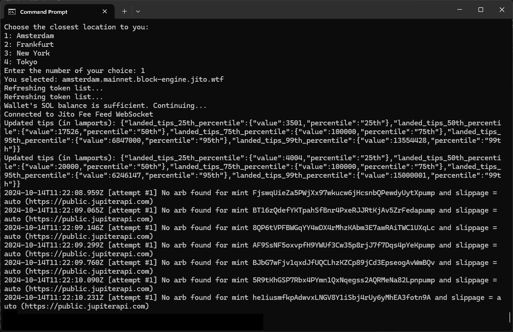

# Poody's Bots for Solana

## Contents

- 🐦 Poody's Arbitrage Bot for Solana 🚀
  - [1.1. Automate Your Gains with Poody’s Arbitrage BOT](#11-automate-your-gains-with-poodys-arbitrage-bot)
  - [1.2. Key Features and Benefits](#12-key-features-and-benefits)
  - [1.3. Advanced Technology for Maximum Gains](#13-advanced-technology-for-maximum-gains)
  - [1.4. Why Choose Poody’s Arbitrage Bot?](#14-why-choose-poodys-arbitrage-bot)
  - [1.5. How to Run the Bot](#15-how-to-run-the-bot)
- 🐦 Poody's Volume Bot for Solana 🚀
  - [2.1. Maximize Your Token's Visibility with Our Premier Volume Boosting BOT](#21-maximize-your-tokens-visibility-with-our-premier-volume-boosting-bot)
  - [2.2. Key Features and Benefits](#22-key-features-and-benefits)
  - [2.3. Advanced Technology for Authentic Engagement](#23-advanced-technology-for-authentic-engagement)
  - [2.4. Why Choose Poody's Volume Bot?](#24-why-choose-poodys-volume-bot)
  - [2.5. How to Run the Bot](#25-how-to-run-the-bot)
- 🐦 Poody's Market Maker Bot for Solana 🚀
  - [3.1. Automate Your Solana Trades with Poody’s Market Maker BOT!](#31-automate-your-solana-trades-with-poodys-market-maker-bot)
  - [3.2. Key Features and Benefits](#32-key-features-and-benefits)
  - [3.3. Advanced Technology for Smarter Trading](#33-advanced-technology-for-smarter-trading)
  - [3.4. Why Choose Poody’s Market Maker Bot?](#34-why-choose-poodys-market-maker-bot)
  - [3.5 How to Run the Bot](#35-how-to-run-the-bot)

## 1. 🐦 Poody's Arbitrage Bot for Solana 🚀

### 1.1. Automate Your Gains with Poody’s Arbitrage BOT

Discover the power of our arbitrage bot, designed to automate your trades and capitalize on price differences between markets. Whether you're a seasoned trader or new to the game, our bot helps you make money effortlessly, even while you sleep!

### 1.2. Key Features and Benefits:

- **Automated Profit:** Our bot scans different Solana liquidity pools for price differences in real time, then automatically buys low and sells high, capturing arbitrage opportunities instantly.
- **Risk-Free Entry:** The bot is **completely FREE to download and use**, with no transaction fees applied. Poody benefits as the bot reserves part of the profits to $Poody supply, making it a win-win for everyone.
- **Maximize Efficiency:** The bot operates 24/7, ensuring that you never miss a profitable opportunity. Set it up and let it do the work for you while you sit back and enjoy the returns.
- **Simple Setup:** The bot creates a wallet address for you and is designed to handle all the trading parameters for you so you could start running the bot with just a few clicks and never lose!

### 1.3. Advanced Technology for Maximum Gains:

- **Real-Time Price Scanning:** Our bot scans all available Solana markets multiple times per second to find the best arbitrage opportunities, ensuring you catch profitable trades.
- **Shortlist Mechanism:** The bot captures successful trades multiple times for even higher efficiency.
- **Dynamic Fee Calculation:** The bot adapts its fee strategy on the fly, maximizing your chances of completing successful trades.
- **Runs on Multiple Devices:** Available for **Windows**, **MacOS**, and **Linux**, you can run Poody’s arbitrage bot on any system of your choice for a smooth trading experience.

### 1.4. Why Choose Poody’s Arbitrage Bot?

At Poody, we believe in providing powerful, user-friendly tools that everyone can use to enhance their crypto experience.

- **No Fees, No Barriers:** Poody’s bot is **completely free** - no transaction fees or complicated purchases. We want as many people as possible to adopt the bot, which in turn helps $Poody for further developments of initiatives.
- **Win-Win Model:** The more you use the bot, the more it benefits both you and the entire Poody community by increasing $Poody's market activity and value.
- **Hassle-Free Operation:** All you need is to download, run the bot and pick a location of the server that is closest to your network. The rest is fully automated, requiring no interaction from you.

### 1.5. How to Run the Bot

Getting started with 🐦 Poody's Arbitrage Bot 🚀 is straightforward. Just follow these simple steps and start capturing arbitrage profits today!

#### Step 1: Download the Necessary Files

Download the appropiate executable from our GitHub repository - depending on your operating system. That's the only file you’ll need.

#### Step 2: Run the bot - first time

Run the executable to begin the setup process. Once completed, the setup will generate the following file in the same folder as the bot:
- `_CONFIDENTIAL_DO_NOT_SHARE.csv`: Contains you wallet's PUBLIC and PRIVATE key associated with your bot. **Keep this file secure and do not share it**. Back up the file and save it in another location in case it gets removed. The wallet is only stored on your local disk and we do not have access to those, meaning we will not be able to recover them if they get lost.

On the initial run, your bot will show your wallet address and prompt you to add a balance of 0.15 SOL:

#### Step 3: Fund Your Wallet

Fund the main wallet that the bot will use for arbitrage trades - the exact one from step 2. This is the only wallet you need to keep an eye on — our bot handles all transactions automatically.

#### Step 4: Run the Bot

Once your wallet is funded, you can pick your server location to start the bot. It will immediately begin scanning markets for arbitrage opportunities. The server location should be one that is closest to you, or if you are using a VPN service - closest to the VPN's location.

When the bot is operational, it should look like below:

That’s it! You’re now leveraging the power of our arbitrage bot to capture profits while you relax!

## 2. 🐦 Poody's Volume Bot for Solana 🚀

### 2.1. Maximize Your Token's Visibility with Our Premier Volume Boosting BOT

Unlock the potential of your Solana token by amplifying its trading volume with our cutting-edge volume bot. This full-service solution is designed to enhance your token's market presence, making it more visible and increasing its likelihood of trending on top analytical websites such as Dextools, Dexscreener, Birdeye, and more.

### 2.2. Key Features and Benefits:

- **Boost Your Token’s Profile:** Our bot allows you to significantly increase the trading volume of any Solana token listed on Jupiter (verified or not - doesn't matter!), elevating its visibility and status within the market.
- **Trend on Major Platforms:** Higher trading volumes can lead to your token being featured as a trending asset on various crypto analytics platforms, which attracts more attention from investors and traders.
- **Fully Managed Service:** Enjoy a hassle-free experience with our bot. No need to worry about technical expertise, just run the .exe files!
- **Low Fees:** You don't need to pay enormous amounts to buy the code from us - it is actually FREE! The bot only transfers out 0.08% of each landed transaction.

### 2.3. Advanced Technology for Authentic Engagement:

- **Dynamic Trading with Multiple Wallets:** Our system utilizes multiple wallets that engage in buying activities to mimic organic market behavior, enhancing the authenticity of the trade volumes. You can provide your own number of buyer wallets in the setup process.
- **Natural Trading Patterns:** We aim to make trading activities appear seamless and natural, avoiding any indications of bot involvement to maintain credibility and market integrity.
- **Powered by Jito:** To ensure stability and reliability, our service integrates Jito technology, guaranteeing a smoother and more consistent trading performance.

### 2.4. Why Choose Poody's Volume Bot?

At Poody's, we believe in making tools accessible and affordable for everyone.

- **Affordability First:** Unlike many services that require you to purchase expensive software or pay hefty upfront fees, our bot is completely free to download. We aim to democratize access to volume boosting technology, ensuring that every token can have its day in the spotlight without breaking the bank.
- **Low Running Costs:** We keep it simple and transparent. There’s no catch; the code is free, and we only charge a minimal fee of 0.08% per transaction. This allows you to maximize your investment in your token's visibility without worrying about excessive costs.
- **Hassle-Free Setup:** Say goodbye to complicated acquisition processes. With our volume bot, you don’t need to go through negotiations or complex payment setups. Simply download the binaries directly from our repository and start boosting your token's volume immediately. This streamlined approach saves you time and lets you focus on what really matters—growing your project.

Download our bot today and see the difference for yourself!

### 2.5. How to Run the Bot

Getting started with 🐦 Poody's Volume Service 🚀 is straightforward. Follow these simple steps to activate your bot and begin boosting your token's volume today!

#### Step 1: Download the Necessary Files

Download the setup and bot executables from our repository. These files are essential to start and operate your bot.

#### Step 2: Set Up the Bot

Run `setup` executable to begin the setup process. This executable will guide you through configuring your bot.

During the setup, you will be prompted to enter various settings. These settings are crucial as they customize the bot's operations according to your needs. The setup process will create two important files:

- `.env` file: Contains all your settings.
- `_CONFIDENTIAL_DO_NOT_SHARE.csv`: This file lists all the wallets used by the bot. Keep this file secure and do not share it.

#### Step 3: Fund the Main Wallet

Once setup is complete, you need to fund the main wallet address provided by the bot. **This is the only wallet you need to fund directly!** The bot will automatically distribute the necessary funds to other associated addresses.

#### Step 4: Run the Bot

After funding, execute `run_bot` executable to start the bot. The bot will begin trading based on the configurations you set during the setup process.

 <!-- Replace this src with the actual URL where the image is hosted -->

Now, sit back and watch as your token’s trading volume starts to grow. You are now leveraging our advanced volume boosting technology!

## 3. 🐦 Poody's Market Maker Bot for Solana 🚀

### 3.1. Automate Your Solana Trades with Poody’s Market Maker BOT!

Take control of your trading with Poody’s Market Maker Bot, designed to automate your trading strategy by buying low and selling high. Whether you’re looking to capitalize on market volatility or help market-making your own token, this bot does the hard work for you!

### 3.2. Key Features and Benefits:

- **Automatic Buying & Selling:** The bot scans the market, automatically buying tokens when prices dip and selling them into pumps. This helps you maximize gains without having to monitor the market constantly.
- **Configurable Settings:** You can choose your own parameters - set your thresholds for buying low and selling high, and the bot will handle the execution. Don;t know where to start? We provide the defaults!
- **Maximize Profits:** By automating your strategy, the bot ensures you never miss an opportunity, executing trades in time to capitalize on market fluctuations.
- **Works with any major Solana LP Provider:** You can manage your tokens and run the bot with no major restrictions, we support all relevant liquidity providers including pump.fun and Moonshot!
- **Low Fees:** You don't need to pay enormous amounts to buy the code from us - it is actually FREE! The bot only transfers out 0.08% of each landed transaction.

### 3.3. Advanced Technology for Smarter Trading:

- **Market Scanning:** The bot monitors price fluctuations at specified intervals (e.g., every 5 minutes) to identify opportunities to buy low and sell high.
- **Threshold-Based Trading:** You set the price thresholds. When the market hits those points, the bot automatically buys when the price dips and sells when it pumps - allowing you to maximize profits.
- **Seamless Trades:** The bot works with needing manual intervention, it's all on autopilot!

### 3.4. Why Choose Poody’s Market Maker Bot?

At Poody, we believe in making trading easier and more efficient for everyone.

- **Fully Automated Trading:** Set it up, and let the bot take over. It executes buy and sell orders according to your strategy while you relax.
- **Hands-Off Profit Maximization:** The bot keeps an eye on the market for you, ensuring you don’t miss out on dips and pumps - even when you’re away from the screen.
- **Quick Setup:** With just a few configuration settings, anyone can set up the bot in no time.

### 3.5. How to Run the Bot

Getting started with 🐦 Poody’s Market Maker Bot 🚀 is straightforward. Follow these steps to configure the bot and start automating your trades today!

#### Step 1: Download the Necessary Files

Download the appropiate executable from our GitHub repository - depending on your operating system. That's the only file you’ll need.

#### Step 2: Create a new wallet and export the private key

Create a new account in your wallet and send the funds to it. In general - the higher the account balance, the more effective the bot will be on influencing the token's price.

#### Step 3: Configure your bot

Run the bot executable and pick "1" in the menu to begin the setup process. Configure your preferences including:

- Token to trade (contract address - ca)
- Percentage thresholds (in percentage - 5 meaning 5%)
- Time intervals for market checks (in minutes)

Here's a view of the setup process:

The bot always will pair the provided token with SOL, as most of the pools are defaultly denominated in Solana.

Once configured, the bot will generate the following key file:
- `settings.txt`: Contains your trading parameters and your wallet key. **Keep this file secure and do not share it**. The private key is only stored on your local disk and your wallet - we do not have access to those! We will not be able to recover them if they get lost.

#### Step 4: Run the Bot

Once all the previous steps are complete, pick "2" in the menu to start the bot. It will begin scanning the market and executing trades based on your configuration.

You can stop the bot at any time by pressing `q` and Enter. The bot logs all transactions and market activity, so you can monitor its performance.

With Poody’s Market Maker Bot, you’ll automate your trading strategy, buy dips, sell into pumps, and keep your portfolio growing—all without constant market monitoring!
